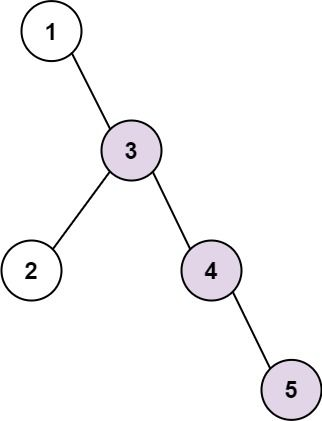
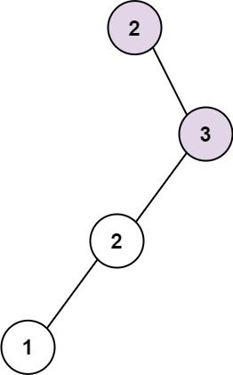

Here’s the updated problem description for **298. Binary Tree Longest Consecutive Sequence** with Markdown formatting:

---

### **298. Binary Tree Longest Consecutive Sequence**

---

### Description

Given the root of a binary tree, return the length of the longest consecutive sequence path.

A consecutive sequence path is a path where the values increase by one along the path.

Note:  
- The path can start at any node in the tree.  
- You cannot go from a node to its parent in the path.

---

### **Example 1:**

**Input:**  
`root = [1, null, 3, 2, 4, null, null, null, 5]`

**Output:**  
`3`

**Explanation:**  
The longest consecutive sequence path is `3-4-5`. So, the output is `3`.

---

### **Example 2:**

  

**Input:**  
`root = [2, null, 3, 2, null, 1]`

**Output:**  
`2`

**Explanation:**  
The longest consecutive sequence path is `2-3`, not `3-2-1`. So, the output is `2`.

---

### **Constraints:**

- The number of nodes in the tree is in the range `[1, 3 * 10^4]`.  
- `-3 * 10^4 <= Node.val <= 3 * 10^4`.