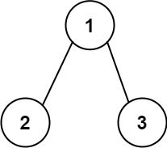
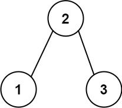

### Problem Description

Given the root of a binary tree, return the length of the longest consecutive path in the tree.

A consecutive path is a path where the values of the consecutive nodes in the path differ by one. This path can be either increasing or decreasing.

For example, `[1, 2, 3, 4]` and `[4, 3, 2, 1]` are both considered valid, but the path `[1, 2, 4, 3]` is not valid.  
On the other hand, the path can be in the child-parent-child order, where the parent-child order is not necessarily followed.

### Example 1:

**Input:**  
`root = [1, 2, 3]`

**Output:**  
`2`

**Explanation:**  
The longest consecutive path is `[1, 2]` or `[2, 1]`.

---

### Example 2:

**Input:**  
`root = [2, 1, 3]`

**Output:**  
`3`

**Explanation:**  
The longest consecutive path is `[1, 2, 3]` or `[3, 2, 1]`.

---

### Constraints:

- The number of nodes in the tree is in the range `[1, 3 * 10^4]`.
- `-3 * 10^4 <= Node.val <= 3 * 10^4`